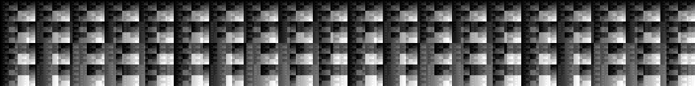
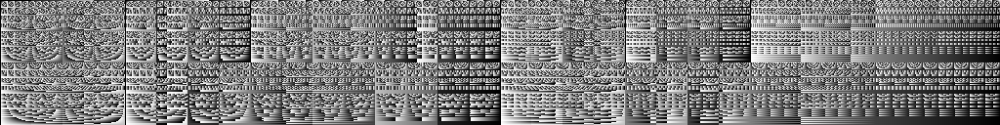

# Byte Beat for OS X

A collection of simple programs that generate 8-bit sound & images.

# ! ! ! WATCH YOUR EARS ! ! !

Audio produce by this application can damage _hearing_, and equipment.
Always run output signals through compressor/envelope/amp/attenuator/attenuverter!

    [ mac ]--+
             |
             $~ Compressor
             |
             +-->[ headphone amp ]--+
                                    |
                                    $~ Reduce
                                    |
                                    +-->[ you ]

## Installation

Just ensure your on OS X 10.11, and have Xcode installed

    git clone https://github.com/emcconville/bytebeatx.git
    cd bytebeatx
    xcodebuild
    sudo cp build/Release/bytebeat /usr/local/bin/bytebeat

> If your building on OS X before 10.11, be sure to set `MACOSX_DEPLOYMENT_TARGET` 
>
>     xcodebuild MACOSX_DEPLOYMENT_TARGET=10.10
>
> See [this issue](https://github.com/emcconville/bytebeatx/issues/1) for additional detail.

## Basic Usage

The `bytebeat` utility runs a single "program" to generate either Audio PCM
singles, or PNG image representation.

### Generate Audio

    bytebeat +<frequency> -<label>

Where `+<frequency>` is the audio single frequency (e.g. 44.1kHz, 11.0kHz, or
8.0kHz). The default value is 8000.0.

    bytebeat +44100.0

The `-<label>` is the name of the "program" to run.

    bytebeat -bbc

### Generate Image

    bytebeat -width <int> -height <int> -image <path/to/image.png>

Both width & height of the image can be defined with `-width <int>` and
`-height <int>`. PNG image will be saved to the following argument to
`-image <path>`. The `-<label>` option can switch "programs" to run.

#### For example

Generated an image representation...

    bytebeat -bbb -width 1024 -height 128 -image bbb.png

Then play it...

    bytebeat -bbb

